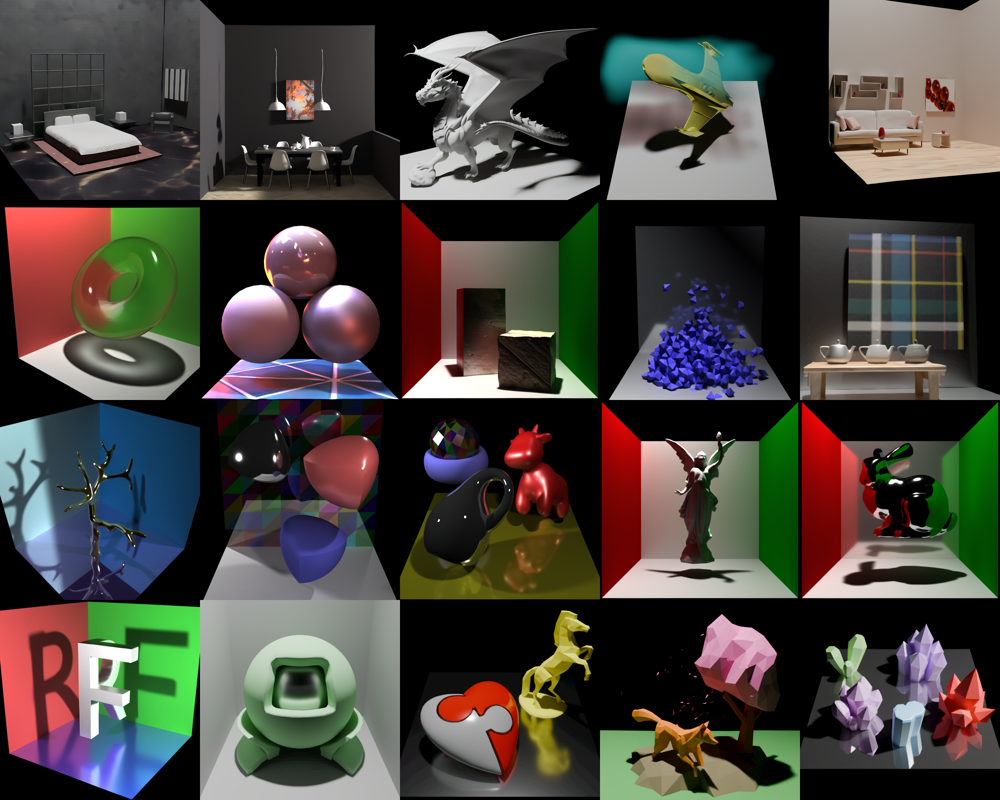

<div align="center">
  

  <h1>RenderFormer Studio</h1>
  <p>
    Official, portable data-generation, training, and inference workflows for
    RenderFormer and RenderFormer-V2.
  </p>
  <p>
    <strong>Agent-friendly by design:</strong> one CLI, stage-numbered recipes,
    and machine-readable receipts for reproducible data, training, and inference.
  </p>

  <p>
    <strong>RenderFormer-V2 [ECCV 2026]:</strong>
    <a href="https://www.chong-zeng.com/">Chong Zeng</a> ·
    <a href="https://yuedong.shading.me/">Yue Dong</a> ·
    <a href="https://www.cs.wm.edu/~ppeers/">Pieter Peers</a> ·
    <a href="https://lllyasviel.github.io/lvmin_zhang/">Lvmin Zhang</a> ·
    <a href="https://graphics.stanford.edu/~maneesh/">Maneesh Agrawala</a>
  </p>
  <p>
    <strong>RenderFormer [SIGGRAPH 2025]:</strong>
    <a href="https://www.chong-zeng.com/">Chong Zeng</a> ·
    <a href="https://yuedong.shading.me/">Yue Dong</a> ·
    <a href="https://www.cs.wm.edu/~ppeers/">Pieter Peers</a> ·
    <a href="https://svbrdf.github.io/">Hongzhi Wu</a> ·
    <a href="https://scholar.google.com/citations?user=P91a-UQAAAAJ&amp;hl=en">Xin Tong</a>
  </p>

  
  <p>
    RenderFormer-V2 (top) and RenderFormer (bottom), rendered by the released
    inference pipelines. Scene credits:
    <a href="examples/rf2/PAPER_SCENE_ATTRIBUTIONS.md">V2</a> ·
    <a href="examples/rf1/ASSET_ATTRIBUTIONS.md">V1</a>.
  </p>

  <p>
    <a href="https://microsoft.github.io/renderformer/"><strong>V1 Project</strong></a>
    |
    <a href="https://renderformer.github.io/v2/"><strong>V2 Project</strong></a>
    |
    <a href="https://renderformer.github.io/pdfs/renderformer-paper.pdf"><strong>V1 Paper</strong></a>
    |
    <a href="https://renderformer.github.io/v2/pdfs/renderformer2-paper.pdf"><strong>V2 Paper</strong></a>
    |
    <a href="#published-models"><strong>Models</strong></a>
    |
    <a href="docs/README.md"><strong>Documentation</strong></a>
  </p>
</div>

RenderFormer Studio unifies the maintained public implementation of both
RenderFormer generations, including scene-data preparation, model definitions,
training recipes, and inference pipelines.

V1 and V2 now share one model implementation. Training loads the trainable
`RenderFormerModel` component directly; inference uses
`RenderFormerPipeline` or `RenderFormerV2Pipeline` to assemble preprocessing,
auxiliary encoders, and rendering around that same component.

Use the [documentation index](docs/README.md) to find the maintained guide,
machine-readable source, and validation path for each workflow.

The distribution is named `renderformer-studio`; its Python package and only
console command are both named `renderformer`.

<a id="published-models"></a>

## 🤗 Published models

| Role | Hugging Face repository | Component subfolder | Link |
| --- | --- | --- | --- |
| V1 Base | `microsoft/renderformer-v1-base` | repository root | [Link](https://huggingface.co/microsoft/renderformer-v1-base) |
| V1 Large | `microsoft/renderformer-v1.1-swin-large` | repository root | [Link](https://huggingface.co/microsoft/renderformer-v1.1-swin-large) |
| V2 native 512 | `RenderFormer/renderformer-v2` | `transformer_512` | [Link](https://huggingface.co/RenderFormer/renderformer-v2/tree/main/transformer_512) |
| V2 native 2048 | `RenderFormer/renderformer-v2` | `transformer_2048` | [Link](https://huggingface.co/RenderFormer/renderformer-v2/tree/main/transformer_2048) |
| Material autoencoder | `RenderFormer/renderformer-v2` | `material_autoencoder` | [Link](https://huggingface.co/RenderFormer/renderformer-v2/tree/main/material_autoencoder) |
| Diffuse/specular mapper | `RenderFormer/renderformer-v2` | `diffspec_mapper` | [Link](https://huggingface.co/RenderFormer/renderformer-v2/tree/main/diffspec_mapper) |
| Metallic mapper | `RenderFormer/renderformer-v2` | `metallic_mapper` | [Link](https://huggingface.co/RenderFormer/renderformer-v2/tree/main/metallic_mapper) |
| Metallic/transmission mapper | `RenderFormer/renderformer-v2` | `metallic_transmission_mapper` | [Link](https://huggingface.co/RenderFormer/renderformer-v2/tree/main/metallic_transmission_mapper) |

The V2 artifacts live in one componentized repository. A single repository
revision selects the two transformers, material autoencoder, and all three
mapper MLPs atomically. Authenticate with Hugging Face whenever the repository
is access-protected during release staging. Omit `revision` to follow the
bundle's default revision, or pass the same explicit branch, tag, or commit
when a reproducible component set is required. The package does not silently
replace it with a hard-coded commit hash.

<a id="repository-layout"></a>

## 🗂️ Repository layout

```text
src/renderformer/
  pipelines/         RF1 and RF2 inference pipelines
  models/            shared transformer and material-model architectures
  data/              generation, conversion, H5 schemas, and loaders
  training/          RF1, RF2, and material-autoencoder training runners
  ops/               maintained CUDA/Triton operators
  cli/               unified command dispatcher and inference CLI
configs/
  model/{v1,v2,material}/  architecture-only YAML
  data/{v1,v2}/      stage-numbered data-generation YAML
  data/material/     material-autoencoder sphere-data YAML
scripts/data/        portable generation recipes and data utilities
scripts/train/       portable release-stage training launchers
examples/{rf1,rf2}/  runnable scene sources, launchers, and provenance
docker/              dependency-only runtime and data-generation images
environments/         Conda interpreter and compiled-system-package manifests
external/            contracts for separately acquired assets and models
licenses/            bundled third-party license texts
tools/blender_addon/  separate V1 and V2 Blender extension sources
docs/                environment, inference, and training guides
```

All wheel-installed runtime code lives in the single `renderformer` package.
The optional Blender integrations are two independent packages under
`tools/blender_addon/`: V1 exports RF1 H5 directly, while V2 exports the
prepared-frame intermediate consumed by the maintained data pipeline. They use
separate identifiers and can be installed together. The public release covers
maintained RF1/RF2 data preparation, training, inference
pipelines, and portable local launchers; deployment orchestration remains the
responsibility of the runtime environment. The RF1 composer's separately
documented legacy float16 material round-trip is input compatibility, not a
model-quantization backend.

<a id="installation"></a>

## ⚙️ Installation

Core libraries, inference, and training support Python 3.10 or 3.11. The base
installation contains lightweight schemas, H5 tools, and CPU-compatible data
commands:

```bash
python -m pip install -e .
```

Verify the unified command surface after installation:

```bash
renderformer --help
renderformer infer --help
renderformer train --help
renderformer data --help
```

From an editable install, use the equivalent
`python -m renderformer <command> ...` module form. In an environment-only
container, `PYTHONPATH=/workspace/renderformer/src` enables the same command
without installing the project. No repository-root launcher wrappers are
required.

Each workflow declares its own optional dependencies. Install the optional
dependency groups you need, or combine several in one command such as
`".[inference,geometry]"`:

```bash
python -m pip install -e ".[inference]" # inference pipelines and CLI
python -m pip install -e ".[training]"  # training entrypoints
python -m pip install -e ".[loaders]"   # PyTorch H5 loaders
python -m pip install -e ".[textures]"  # learned V2 texture/env encoders
python -m pip install -e ".[geometry]"  # remesh and local mesh utilities
python -m pip install -e ".[blender]"   # Blender/Cycles scene generation
```

The `blender` group covers surface-only scene generation. Volume scenes also
need the Python OpenVDB bindings, which are not a portable pip dependency; use
the Conda data-generation environment below for those.

For Blender generation, create the Python 3.11/OpenVDB 13 environment, then
install `bpy==4.5.10` from PyPI and the shared datagen requirements:

```bash
conda env create -f environments/datagen.yml
conda activate renderformer-datagen
# Linux/NVIDIA only; use the CPU command in environments/README.md elsewhere.
python -m pip install \
  torch==2.7.1+cu126 torchvision==0.22.1+cu126 \
  --index-url https://download.pytorch.org/whl/cu126
python -m pip install bpy==4.5.10 --index-url https://pypi.org/simple
python -m pip install -r docker/requirements-datagen.txt
python -m pip install --no-deps -e .
```

Scene export from the Blender UI is also split by model generation. The
repository publishes both extension source packages, not prebuilt ZIPs. If you
want self-contained local installation archives, build the two platform-local,
wheel-bearing packages in this environment. The builder uses the PyPI module
and does not require an installed Blender.app:

```bash
PYTHON_BIN=python \
OUTPUT_DIR=/tmp/renderformer-blender-extensions \
bash tools/blender_addon/build.sh release
```

See the [Blender extension guide](tools/blender_addon/README.md) for installation,
dependencies, supported scene features, and the complete V2 prepared-frame to
inference workflow.

For CUDA 12.6 training and inference, use the Python 3.10 Conda environment,
then install the shared pinned requirements and FlashAttention:

```bash
conda env create -f environments/cuda.yml
conda activate renderformer-cuda
python -m pip install -r docker/requirements-cuda.txt
MAX_JOBS=4 python -m pip install \
  flash-attn==2.7.4.post1 --no-build-isolation --no-cache-dir
python -m pip install --no-deps -e .
```

See [environments/README.md](environments/README.md) for both complete local
environment receipts and CPU-only datagen guidance.

The datagen and CUDA environments are intentionally separate. Generate and
postprocess V2 scene H5 files under `renderformer-datagen`, then activate
`renderformer-cuda` for model inference or training; the public launchers do
not combine both dependency stacks in one process.

Packed-sequence V2 execution requires `flash-attn`. The pipeline fails early
with an actionable error if `USE_SDPA=1` or `ATTN_IMPL=sdpa` conflicts with a
profile that enables packing. The default V2 `release` profile is deliberately
unpacked; the trainer-config `checkpoint` diagnostic may enable packing from
the serialized config.

<a id="inference"></a>

## 🎨 Inference

Both the pipelines and the `renderformer infer` command consume a scene H5
file, so every workflow has two steps: prepare the H5, then render it.

### 1. Prepare a scene H5

An RF1 scene is composed from a JSON description with CPU mesh operations, and
requires neither Blender nor a GPU:

```bash
renderformer data compose-rf1 examples/rf1/cbox.json --output scene.h5
renderformer data validate-h5 --input scene.h5 --format v1
```

An RF2 scene is generated with Blender/Cycles in the datagen environment and
then postprocessed into the model-ready representation. The 12 curated
RF2-only paper-scene definitions are bundled for the V2 200M architecture and
run both stages through one launcher:

```bash
conda activate renderformer-datagen
bash examples/rf2/generate-paper-scene.sh \
  displacement-mapped-cornell-cube \
  /tmp/renderformer-rf2-displacement-mapped-cornell-cube
```

That writes the renderable file to
`/tmp/renderformer-rf2-displacement-mapped-cornell-cube/processed/scene.h5`.
For your own V2 scene, run the two stages explicitly:
`renderformer data generate` writes the raw H5, and `renderformer data convert`
applies the learned texture encoding, environment-map transforms, and volume
conversion. The optional
[Blender extensions](tools/blender_addon/README.md) export from the Blender UI
instead: V1 writes RF1 H5 directly, and V2 writes the prepared-frame
intermediate that the maintained data pipeline consumes.

See [the RF2 example guide](examples/rf2/README.md) for the paper-scene
inventory, source generation launchers, H5 preparation, external asset
requirements, provenance, and auxiliary-model requirements. The
[inference guide](docs/inference/README.md) documents the complete V1 and V2
input-preparation receipts, including the exact RF1 H5 contract and the
raw versus encoded V2 inputs.

### 2. Render the H5

Rendering needs only the inference environment, not the datagen stack. The
CLI records the selected profile, resolved switches, input preprocessing, and
auxiliary component provenance (source, requested revision, and dtype):

```bash
conda activate renderformer-cuda
renderformer infer \
  --input /tmp/renderformer-rf2-displacement-mapped-cornell-cube/processed/scene.h5 \
  --checkpoint RenderFormer/renderformer-v2 \
  --checkpoint-subfolder transformer_512 \
  --precision fp16 \
  --output-dir outputs
```

The same command renders an RF1 scene from the V1 checkpoint:

```bash
renderformer infer \
  --input scene.h5 \
  --checkpoint microsoft/renderformer-v1.1-swin-large \
  --precision fp16
```

The bundled paper scenes also have an inference launcher that selects the
official native-512 or native-2048 Hugging Face model from the scene
resolution; set `CHECKPOINT` only to override it. It does not invoke Blender or
generate data:

```bash
INPUT_H5=/tmp/renderformer-rf2-displacement-mapped-cornell-cube/processed/scene.h5 \
  bash examples/rf2/render-paper-scene.sh \
  displacement-mapped-cornell-cube
```

The Python API consumes the same H5 files. V1/RF1:

```python
from renderformer import RenderFormerPipeline

pipeline = RenderFormerPipeline.from_pretrained(
    "microsoft/renderformer-v1.1-swin-large",
    device="cuda",
)
result = pipeline("scene.h5", precision="fp16")
hdr = result.hdr
```

V2 owns the environment and texture encoder specifications independently and
loads the texture encoder only when a raw texture is supplied:

```python
from renderformer import RenderFormerV2Pipeline

pipeline = RenderFormerV2Pipeline.from_pretrained(
    "RenderFormer/renderformer-v2",
    transformer_subfolder="transformer_512",
    resolution=512,
    device="cuda",
)
result = pipeline("scene.h5", precision="fp16")
```

V2 defaults to the validation-selected `release` profile: view-transformer
TF32 is enabled, packed sequences are disabled, absent environments are
encoded as black, absent volumes retain the checkpoint-sized padded and fully
masked representation, and geometry plus the environment encoder use render
precision. `checkpoint` is an explicit trainer-config diagnostic that reads
the view-transformer and packing switches serialized by training.
`legacy_v2` and `legacy_template_v2` preserve retired historical execution
receipts.

See [the inference guide](docs/inference/README.md) for the complete Python/CLI
workflow, V1 padding guidance, execution profiles, output manifests, and model
version selection. New examples use hyphenated options; the migrated path,
batching, worker, tone-map, and video arguments also retain their documented
legacy underscore aliases.

<a id="training"></a>

## 🧠 Training

Training never constructs an inference pipeline. A fresh run builds
`RenderFormerModel(config)`; a cross-run warm start loads only model parameters:

```python
from renderformer import RenderFormerModel

model = RenderFormerModel.from_pretrained(
    "/path/to/checkpoint",  # directory or model.safetensors
)

# Export only the reusable transformer component, without trainer state.
model.save_pretrained("/path/to/renderformer-model")
```

The wheel installs one public training command. Its first argument selects the
RF1, RF2, or material-autoencoder runner, and every remaining argument is
forwarded unchanged to that runner:

```bash
renderformer train --help
renderformer train rf1 --config_file configs/model/v1/200m_full_attention.yaml --help
renderformer train rf2 \
  --config_file configs/model/v2/200m_sliding_sink_summary.yaml \
  --help
renderformer train material --help
```

The module form invokes the same dispatcher:

```bash
python -m renderformer train rf2 \
  --config_file configs/model/v2/200m_sliding_sink_summary.yaml \
  --help
```

The runners remain separate internally because their data and optimization
loops differ. The shared command provides one stable launch surface without
combining those loops into one branch-heavy implementation. Material training
uses a strict EXR JSONL manifest and the explicit `log10_1p` preprocessing
contract:

```bash
MANIFEST=/datasets/material/exr-manifest.jsonl \
OUTPUT_DIR=/runs/material-autoencoder \
  scripts/train/material_autoencoder.sh --validate

MANIFEST=/datasets/material/exr-manifest.jsonl \
OUTPUT_DIR=/runs/material-autoencoder \
NPROC_PER_NODE=8 \
  scripts/train/material_autoencoder.sh
```

`trainer_config.load_weights` is this model-only initialization path.
`trainer_config.load_ckpt` is intentionally separate and restores the full
Accelerate state, including optimizer, scheduler, and recorded global step.
`trainer_config.auto_resume` explicitly selects the latest full state under the
same run directory; it defaults to `false`. Neither full-state mode can be
combined with model or optimizer component initialization. Model-component
loading also accepts a Hub revision, cache directory, offline mode, and
component subfolder through the matching `trainer_config.load_weights_*`
fields. `load_weights_strict=true` rejects every missing, unexpected, or
shape-mismatched model tensor.

The portable training curriculum has four explicit layers:

1. a data YAML under `configs/data/` defines one semantic generation stage;
2. the matching shell script under `scripts/data/recipes/` launches that data
   recipe without cloud infrastructure;
3. one of three shared renderer model YAML files under `configs/model/`
   defines model structure only; and
4. the same-named stage launcher under `scripts/train/recipes/` binds data,
   model, loader, optimizer, schedule, and a date-free checkpoint edge.

V1 has two stages for Base and two for Large. V2 has eight stages and reuses
the final 200M sliding/sink/summary model config throughout. Training launchers
consume the matching data launcher's `OUTPUT_DIR/paths.txt`; they do not expose
historical dataset IDs or dated experiment names.

The fourth architecture YAML, `configs/model/material/autoencoder.yaml`, belongs
to the standalone manifest-driven material recipe above rather than to the
renderer curriculum. See the
[full training receipt](docs/training/README.md#material-autoencoder-recipe).

For example, generate and train V2 stage 1 without AML or Kubernetes:

```bash
export DATASET_ROOT=/datasets/renderformer
export OUTPUT_ROOT=/runs/renderformer
export WANDB_MODE=offline

OUTPUT_DIR="${DATASET_ROOT}/v2/stage_01_1k_no_env_no_volume" \
NUM_SAMPLES=1000 SEED=3407 ASSET_MANIFEST=/datasets/renderformer/assets.json \
  scripts/data/recipes/v2/stage_01_1k_no_env_no_volume.sh

scripts/train/recipes/v2/stage_01_1k_no_env_no_volume.sh --validate
NPROC_PER_NODE=8 \
  scripts/train/recipes/v2/stage_01_1k_no_env_no_volume.sh
```

See [configs/README.md](configs/README.md) for config ownership,
[scripts/data/README.md](scripts/data/README.md) for data generation,
[scripts/train/README.md](scripts/train/README.md) for launching, and
[the training recipes](docs/training/README.md) for the complete
stage/data/model matrix and known reproduction gaps. The
[documentation index](docs/README.md) provides task-oriented routes to the
inference, training, data, environment, and provenance guides.

<a id="data-generation-and-utilities"></a>

## 🧰 Data generation and utilities

One scene builder exports either model generation through a profile:

```bash
renderformer data generate \
  --template src/renderformer/data/templates/v1/250418_256_res/plane-no-object.jsonc \
  --background-topology-debias \
  --profile src/renderformer/data/profiles/v1_training_rf1.yaml \
  --output-dir /tmp/rf-data \
  --resolution 512 \
  --spp 4096 \
  --texture-size 32
```

V1/V2 PyTorch and DALI loaders live under `renderformer.data.loaders`.
Environment-map processing is shared, and UV/remesh operations are maintained
as optional geometry utilities and scripts. Batch tools consume explicit JSON
metadata manifests and use process-level parallelism.

Prepare the Objaverse object collection and its five metadata-derived runtime
lists before scene generation:

```bash
INPUT_MANIFEST=/datasets/objaverse/sources.jsonl \
OUTPUT_DIR=/datasets/renderformer-assets/objaverse \
  scripts/data/prepare_objaverse.sh
```

The [data receipt](scripts/data/README.md#prepare-the-objaverse-mesh-collection)
documents watertight reconstruction, 1188/3968-face QSlim tiers, UV generation,
the explicit refraction-object selection, resume validation, and the boundary
between the new portable collection and the unrecoverable historical split.

Material-autoencoder EXRs have their own seeded, explicitly sharded receipt:

```bash
renderformer data material-spheres \
  --recipe configs/data/material/material_spheres.yaml \
  --validate
```

See [material-sphere data generation](scripts/data/README.md#generate-the-material-autoencoder-exrs)
for plan, shard, resume-verification, and manifest-finalization commands. It
runs directly under the pinned PyPI `bpy==4.5.10` environment and never calls
an installed Blender application.

The curriculum data recipes preserve template weights, render/export settings,
postprocessing settings, named output-list contracts, and the known V1 merge
row counts. Historical sample budgets, complete random-seed streams, and exact
list ordering/filtering were not recoverable. Regenerated training data is
therefore distribution-compatible with the recorded curriculum, not a
byte-exact reconstruction of the internal dataset.

The public V1 data curriculum contains exactly two scale stages:
[`stage_01_1k_256res`](configs/data/v1/stage_01_1k_256res.yaml) for nominal
1k-token scenes at 256 resolution, then
[`stage_02_4k_512res`](configs/data/v1/stage_02_4k_512res.yaml) for nominal
4k-token scenes at 512 resolution. The actual training padding lengths are
1572 and 4192. Both recipes apply the background-topology correction from stage
1. The second stage retains the historical 250510 14-template, weight-42
distribution while reusing the retained 250428 template files; it is
provenance within the 4k/512 stage, not a separate fix stage. Because the
surviving historical candidate lineage introduced the correction later, the
portable curriculum is a cleaned policy rather than a bitwise replay of an
internal run.

See [src/renderformer/data/README.md](src/renderformer/data/README.md) for schemas,
profiles, external asset mapping, learned postprocessing, and loader behavior.
Bundled example and template meshes have checksum-locked provenance manifests;
their licenses and reuse restrictions are documented in
[examples/rf1/README.md](examples/rf1/README.md).

<a id="environment-only-containers"></a>

## 🐳 Environment-only containers

The Docker images install dependencies only. They never copy this repository
or bake application code into an image:

```bash
docker build -t renderformer-env .
docker build --platform linux/amd64 \
  -f docker/datagen.Dockerfile -t renderformer-datagen-env .
```

Mount an exported source tree read-only at runtime. The release does not ship
AML or Kubernetes infrastructure; an external orchestrator should preserve the
same source/image separation. See
[the environment setup guide](docs/environment-setup/README.md) for the
complete container workflow.

<a id="citation"></a>

## 📚 Citation

If you use RenderFormer Studio, please cite both RenderFormer papers.
Machine-readable metadata is also available in [CITATION.cff](CITATION.cff).

```bibtex
@inproceedings{zeng2025renderformer,
    title     = {RenderFormer: Transformer-based Neural Rendering of Triangle
                 Meshes with Global Illumination},
    author    = {Chong Zeng and Yue Dong and Pieter Peers and Hongzhi Wu and Xin Tong},
    booktitle = {ACM SIGGRAPH 2025 Conference Papers},
    year      = {2025},
    doi       = {10.1145/3721238.3730595}
}

@inproceedings{zeng2026renderformerv2,
    title     = {RenderFormer-V2: Neural Rendering with Heterogeneous Scene Primitives},
    author    = {Chong Zeng and Yue Dong and Pieter Peers and Lvmin Zhang and Maneesh Agrawala},
    booktitle = {European Conference on Computer Vision (ECCV)},
    year      = {2026}
}
```

<a id="license"></a>

## ⚖️ License

RenderFormer-authored code is released under the [MIT License](LICENSE).
Bundled third-party code retains the licenses and pinned-source notices listed
in [THIRD_PARTY_NOTICES.md](THIRD_PARTY_NOTICES.md). External models, datasets,
and assets retain their own licenses and terms. Bundled RF1 meshes have a
[per-file provenance manifest](examples/rf1/ASSET_PROVENANCE.json) and
[attribution notice](examples/rf1/ASSET_ATTRIBUTIONS.md); bundled data-template
geometry has a separate
[manifest](src/renderformer/data/templates/ASSET_PROVENANCE.json). Bundled RF2
scene sources, reference images, and credits are documented in the
[RF2 example guide](examples/rf2/README.md) and
[attribution notice](examples/rf2/PAPER_SCENE_ATTRIBUTIONS.md).
